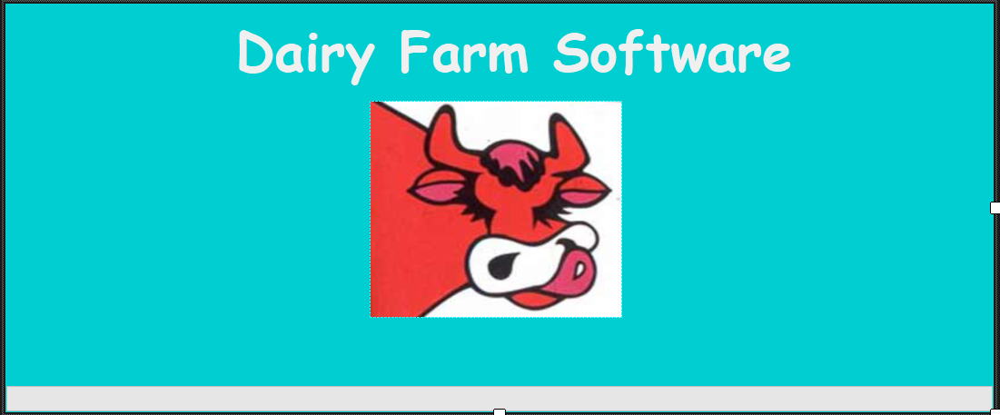

🆕 To create this Windows Form Application, you have to set this options:
 - Language:C#
 - Platform: Windows
 - Type: Desktop

 Note: Make sure you have ".NET Desktop Development" extensions installed, and select the option:
 - Windows Forms App (.NET Framework) - A project for creating an application with a Windows Forms (WinForms) user interface

 
 

 ⏱ To follow my commit changes
 - https://github.com/Royal6969/dairy-farm-project/commits/main

 👓 How to show toolbox and solution explorer and style properties in visual studio
 - https://www.youtube.com/watch?v=lms7X_b1-dY&ab_channel=TamtamQuinn

 🎨 For some UI components styles, I will use Bunifu Framework
  - It requires a paid license, but we can crack it...
  - https://docs2.bunifuframework.com/docs/getting-started/install
  - https://www.youtube.com/watch?v=1QZHT9by2xo&ab_channel=C%C3%B3digoLimpio

  I also installed Guna UI2 Framework, for other styles, and you can get it here (free trial)
  - https://www.nuget.org/packages/Guna.UI2.WinForms/
  or try to crack it too
  - https://www.youtube.com/watch?v=vJ7yB_pZ3a0

 📝 Basic structure to start
 We start with a form template that we rename to Splash.cs (preload screen),
 and after that, we create the Login.cs (login screen) adding a new class element (type Windows Forms)
 
 Tip: To see changes faster, change in Program.cs Application.Run(new Splash()) to Application.Run(new "component"()).

 
 
 
 Let's start with the frontend, so we're going to design the pages (sections)

 ① Cows List (CRUD)

 

 ② Milk Production

 

 ③ Cows Health

 

 ④ Cows Breeding

  

  ⑤ Milk Sales

  

  ⑥ Farm Finances

  

  ⑦ Dashboard

  