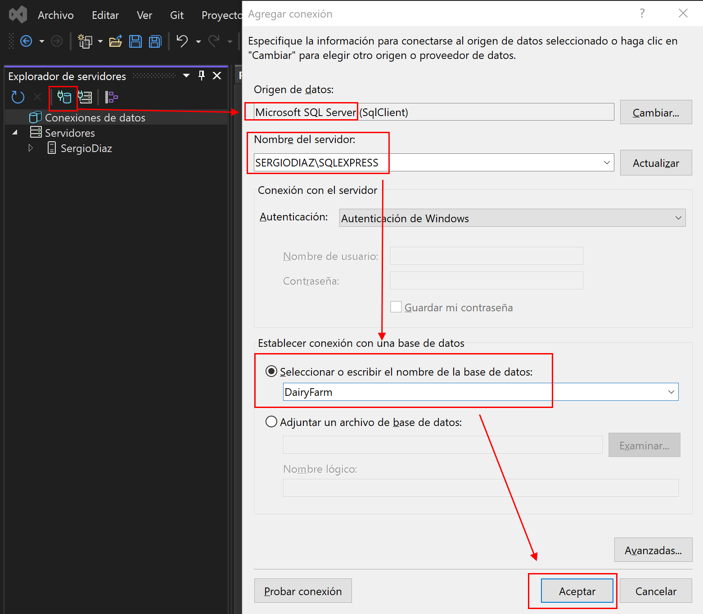

🆕 To create this Windows Form Application, you have to set this options:
 - Language:C#
 - Platform: Windows
 - Type: Desktop

 Note: Make sure you have ".NET Desktop Development" extensions installed, and select the option:
 - Windows Forms App (.NET Framework) - A project for creating an application with a Windows Forms (WinForms) user interface

 
 

 ⏱ ##To follow my commit changes
 - https://github.com/Royal6969/dairy-farm-project/commits/main

 👓 ##How to show toolbox and solution explorer and style properties in visual studio
 - https://www.youtube.com/watch?v=lms7X_b1-dY&ab_channel=TamtamQuinn

 🎨 ##For some UI components styles, I will use Bunifu Framework
  - It requires a paid license, but we can crack it...
  - https://docs2.bunifuframework.com/docs/getting-started/install
  - https://www.youtube.com/watch?v=1QZHT9by2xo&ab_channel=C%C3%B3digoLimpio

  I also installed Guna UI2 Framework, for other styles, and you can get it here (free trial)
  - https://www.nuget.org/packages/Guna.UI2.WinForms/
  or try to crack it too
  - https://www.youtube.com/watch?v=vJ7yB_pZ3a0

 📝 ##Basic structure to start
 We start with a form template that we rename to Splash.cs (preload screen),
 and after that, we create the Login.cs (login screen) adding a new class element (type Windows Forms)
 
 Tip: To see changes faster, change in Program.cs Application.Run(new Splash()) to Application.Run(new "component"()).

 
 
 
 #Let's start with the frontend, so we're going to design the pages (sections)

 ① Cows List (CRUD)

 

 ② Milk Production

 

 ③ Cows Health

 

 ④ Cows Breeding

  

  ⑤ Milk Sales

  

  ⑥ Farm Finances

  

  ⑦ Dashboard

  

  ## 🔗 Let's connect the different sections with sidebar links.
  To do that, in each section, in sidebar, we have to do double click in each sidebar button (in link names),
  and code in .cs will open, the label method exactly.
  And you just have to write something like this:
  
  private void label5_Click(object sender, EventArgs e)
  {
    Cows Ob = new Cows();
    Ob.Show();
    this.Hide();
  }

  In this case, the label button section in sidebar pressed was Cows.

  ## 📚 Time to install SQL Server Express for database (basic features)

  https://www.microsoft.com/en-us/sql-server/sql-server-downloads

  

  ## 💼 Install Microsoft SQL Management Studio

  https://docs.microsoft.com/es-es/sql/ssms/download-sql-server-management-studio-ssms?view=sql-server-ver15

  

  ## 🔌 Connect to your new SQL server and create de database
  
    1. In VS, press View in toolbox and select "Server explorer"
    2. Press teh button "Connect with database"
    3. Write the name of server provided by SQL Server Management Studio and the new database name
    4. Confirm that doesn't exists and you want to create it

  
  
  

  ## 📋 Create the tables for the database

  Press right click in "Tables" to add new one, 
  and add all fields you need, with the name, data type, no nulls...
  
  Tip: use the default id and rename it to use it as PK, or right click in one field to make it primary key

  After all, you have to "update" the table (remember to press the "refresh" button in Server Explorer)

  
  

  ① Milk Production Table

  

  ② Cows Table

  

  ③ Employees Table

  

  ④ Health Table

  

  ⑤ Sales Table

  

  ⑥ Expenditure Table

  

  ⑦ Income Table

  

  ⑧ Breeding Table

  

  ## 🖇️ Connect tables with Foreign Key

  Now we just need to connect the tables among them with foreign keys

